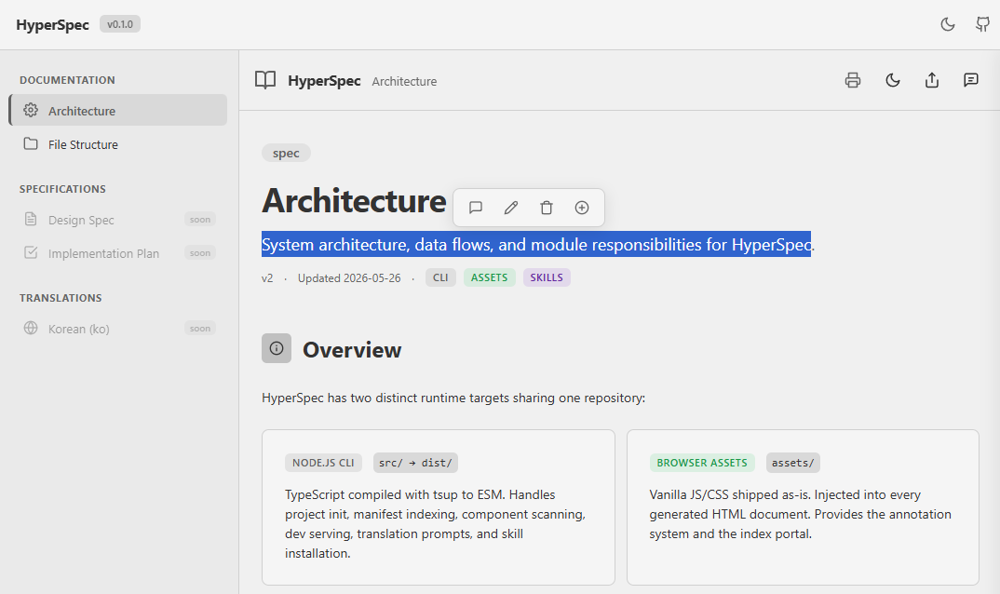

# HyperSpec

Annotatable HTML document generation skills for AI coding agents.

Agents generate rich, interactive HTML (tables, SVG, tabs, code blocks) instead of markdown. Users annotate in-browser, export structured JSON feedback, and paste it back — the agent applies changes and increments the version.

Inspired by Thariq Shihipar's ([@trq212](https://x.com/trq212/status/2052811606032269638)) ["HTML is the new markdown"](https://www.lennysnewsletter.com/p/html-is-the-new-markdown-how-anthropic) -- the idea that AI agents should output HTML instead of markdown because it enables color, charts, interactivity, and direct sharing. HyperSpec was built to make that practical: give agents a skill that converts existing markdown docs into rich HTML, with a built-in annotation loop for iterative feedback.

<p align="center"></p>

## Features

- **Rich HTML generation** -- Tables, SVG diagrams, code blocks, tabs, accordions, and interactive elements instead of flat markdown
- **In-browser annotation** -- Select text, add comments/modify/delete/insert annotations, export structured JSON feedback
- **Iterative revision** -- Paste annotation JSON back to the agent; it applies changes and increments the version
- **Dual navigation mode** -- Pages include a section-level TOC sidebar for standalone viewing; when loaded through the portal (`index.html`), the per-page sidebar auto-hides and the portal's page-level navigation takes over
- **Multi-agent support** -- Works with Claude Code, Codex, and Antigravity via agent-specific skill files
- **Component library integration** -- Register CSS/JS component libraries; agents prefer registered components during generation
- **Static-site ready** -- Output is plain HTML/CSS/JS with no build step; drop `docs/html/` into GitHub Pages, S3, or any static host
- **Translation workflow** -- Generate locale-specific translations with automatic outdated-version detection

## Install

```bash
npm install -g hyperspec
```

## Quick Start

```bash
hyperspec init          # scaffold docs/html/ in your project
hyperspec serve         # preview at http://localhost:4444
hyperspec index         # rebuild manifest.json from htmls/
hyperspec setup         # register a component library
hyperspec install claude-code  # install agent skills
```

## Agent Usage

```
/hyperspec docs/spec.md          # convert markdown to HTML
/hyperspec                       # generate interactively
/hyperspec-feedback              # apply annotation JSON
/hyperspec-translate file --locale ko
```

## Documentation

| File | Description |
|------|-------------|
| [`CLAUDE.md`](CLAUDE.md) | Project instructions for AI agents |
| [`docs/00.Architecture.md`](docs/00.Architecture.md) | System architecture and data flows |
| [`docs/01.FileStructure.md`](docs/01.FileStructure.md) | Repository layout with file descriptions |

## License

MIT
